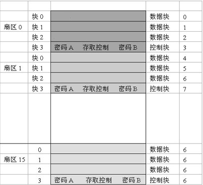
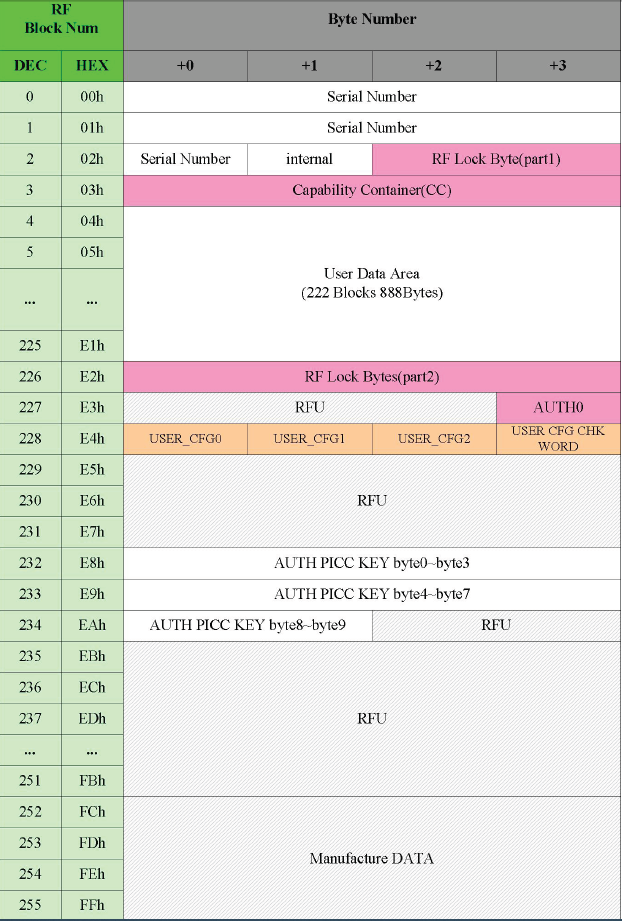
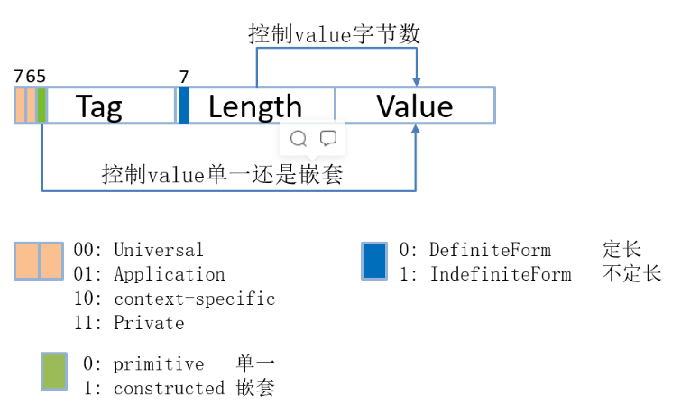
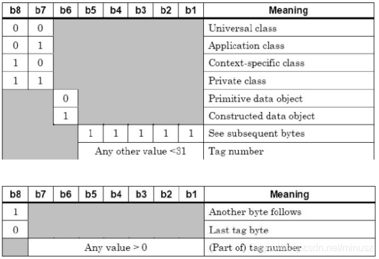

# NiobeU4开发板NFC使用说明文档

近场通信（Near Field Communication，简称NFC），是一种新兴的技术，使用了NFC技术的设备（例如移动电话）可以在彼此靠近的情况下进行数据交换，是由非接触式射频识别（[RFID](https://baike.baidu.com/item/RFID/497249)）及互连互通技术整合演变而来的，通过在单一芯片上集成感应式读卡器、感应式卡片和点对点通信的功能，利用移动终端实现移动支付、电子票务、门禁、移动身份识别、防伪等应用。`NiobeU4`基于复旦微的`FM17622`芯片，开发了twnfc组件，方便用户快速的进行NFC应用开发。

## 预备知识

`FM17622`芯片是一款高度集成的、工作在13.5MHz下、支持低功耗检测功能的非接触读写器芯片。FM17622具有低电压、低功耗、驱动能力强、多接口支持、多协议支持等特点。适用于低功耗、低电压、低成本要求的非接触读写器应用。支持以下两种不同的工作模式：

- 支持符合`ISO/IEC 14443` TypeA 协议的读写器模式
- 支持符合`ISO/IEC 14443` TypeB 协议的读写器模式

`Type A型`卡在读写机上向卡传送信号时，是通过13.56MHz的射频载波传送信号。其采用方案为同步、改进的Miller编码方式，通过100%ASK传送；当卡向读写机具传送信号时，通过调制载波传送信号。使用847kHz的副载波传送Manchester编码。 

而`Type B型`卡在读写机具向卡传送信号时，也是通过13.56MHz的射频载波信号，但采用的是异步、NRZ编码方式，通过用10%ASK传送的方案；在卡向读写机具传送信号时，则是采用的BPSK编码进行调制。 

对比两种卡型，可以看出，Type B型与Type A型卡相比有以下优势： 

（1）芯片具有更高的安全性。接收信号时，不会因为能量损失而使芯片内部逻辑及软件工作停止。 
（2）支持更高的通讯速率。Type A最大的数据通讯速率为150Kbit/s -200Kbit/s ，应用10%ASK技术的Type B至少可支持400Kbit/s 的速率。 
（3）外围电路设计简单。读写机具到卡以及卡到读写机具的编码方式均采用NRZ方案，电路设计对称，设计时可使用简单的UARTS。 
（4）抗干扰能力强。负载波采用BPSK调制技术，较Type A方案降低了6dB的信号声。 

在ISO/IEC 14443-3规定了TYPEA，TYPEB 的防冲突机制。二者防冲突机制的原理完全不同。前者是基于BIT冲突检测协议，后者则是通过字节、帧及命令完成防冲突。防冲突机制使非接触式IC卡能进行并行操作，及在多张卡同时进入有效操作区后，可对其进行有条不紊的操作，这样就使 选定卡片的数据不受其它卡数据干扰，携带有多种卡的用户可不必寻找正确的一张卡，只用算法编程，读写机具即可自动做到选取正确的一张卡进行后续操作。这样方便了操作，提高了应用的并行性，也提高了系统的速度。

`关于两种类型的卡片的分类`：

```
.
├── TypeA卡
│   ├── MifareOne(市面上卡80%是M1卡)
│   │   ├── S50 (容量：1K）
│   │   ├── S70 (容量：4K)
│   │   └── ...
│   ├── NTAG
│   │   ├── NTAG213(容量：180Bytes 可读写：144Bytes)
│   │   ├── NTAG215(容量：540Bytes 可读写：504Bytes)
│   │   ├── NTAG216(容量：924Bytes 可读写：888Bytes)
│   │   └── ...
│   ├── UID卡(M1模拟卡,可以随意修改UID)
│   └── ...
└── TypeB卡
    └── CPU卡(如居民二代身份证、部分银行卡等)
```

### MifareOne卡(M1卡)
M1卡常见的卡片型号分为S20卡、S50卡、S70卡等，区别在于存储大小不同，以应用最广泛的S50卡为例：

S50分为16个扇区、每个扇区4块(0~3 Block)、共64块，每块16个字节。

 

按块号编址为0~63，第0扇区的块0用于存放厂商代码，已经固化不可更改。

其它扇区的块0、块1、块2为数据块，用于存储数据，块3为控制块，分别存放:

`密码A(6bytes)`、`存取控制(4bytes)`、`密码B(6bytes)`

每个扇区的密码和存取控制是独立的，可以根据实际需要设定各自的密码及存取控制。三个控制位以正和反两种形式存在于存取控制字节中，决定了该块的访问权限。如果进行减值操作，必须验证KEYA, 如果进行加值操作，必须验证KEYB。

`注意`：
1. M1卡读、写新的扇区前要先通过认证。
2. 在存储控制前后的密码KEYA与密码KEYB读取出来都为0x00，并不代表该密码就是0x00，而是对密码进行了保护。修改认证密码可以防止别人获取到数据。

### NTAG卡
NTAG213、NTAG215和NTAG216由恩智浦半导体公司开发，并作为标准NFC标签IC与NFC设备或NFC兼容型近距离耦合设备配合，广泛用于市场应用，如零售、游戏和消费电子等。NTAG213、NTAG215和NTAG216（后文通称为NTAG21x）设计为完全符合NFC Forum类型2标签和ISO/IEC14443类型A规范。

目标应用包括户外和印刷媒体智能广告、SoLoMo应用、产品验证、NFC货架标签、手机配套标签。目标用例包括户外智能广告、产品认证、手机配套标签、蓝牙或Wi-Fi配对、电子货架标签和名片。还可对NTAG21x存储器进行分段，以同时部署多个应用。

以NTAG216卡片为例：

EEPROM 以4 字节为1 个Block 来组织，READ 和WRITE 均以Block 地址作为最小寻址单位，READ 指令中的地址为读取的起始地址，依次读出4 个Block 的数据。WRITE 指令每次写入当前地址对应的Block。

扣除制造商信息区和配置信息区后，用户可以使用的数据空间为Block `04h~E1h`，总计222 Blocks，即888 字节。E2h 存储Dynamic Lock Bytes。`E3h~FBh` 为芯片配置信息区，`FCh~FFh` 为制造商信息区。整体空间划分示意图如下：

​	

NTAG卡的`序列号`也就是UID一共有七个，存放在page0, page1中, 其中UID0~UID2在page0中的前三个字节,第四个字节是卡类型与前3个字节的UID的BCC异或校验。UID3~UID6在page1中，UID3~UID6的BCC校验在page2的第一个字节。

### BER与TLV

BER（BasicEncoding Rules）是一种编码规格说明，描述如何将 ASN.1 类型的值编码成字节串(string of octets)的方法。其他编码规则是在BER的基础上添加新的规则构成，比如 DER。

TLV是BER编码的一种，为了使手机准确识别出多种或多段NFC标签信息，需要使用TLV格式。BER传输语法的格式一直是TLV **三元组** <Tag,Length, Value>， 每一段占一个字节。其中Value部分可以[嵌套](https://so.csdn.net/so/search?q=嵌套&spm=1001.2101.3001.7020)另一个 TLV，其格式如下：

 

- Tag字段的含义

  Tag分为3部分，最高两位，第六位和低五位。

  bit8~bit7：组合代表tag所属类型

  ```
  00 通用级 universal class
  01 应用级 application class
  10 规范级 context-specific class
  11 私有级 private class
  ```

  bit6：是否具有嵌套的TLV子结构。

  bit5~bit1：如果为全1，则Tag扩展至后续的字节，否则是具体的Tag正文。

   

  Tag后续字节：
  bit8：为1时存在后续字节，为0时不存在后续字节
  bit7~bit1：Tag正文

- Length字段含义:

  首字节bit8：

  如果为0，则该Length仅有1字节，bit7~bit1值代表Value字段的长度。

  如果为1，则表示长度有扩展字节，bit7~bit1值代表后续扩展的字节数，后续扩展字节数表示Value字段的长度。

- Value字段含义:

  Value数据段一般没有特定的编码规则，但在某些场合，如果首字节的Bit8为1时，需要前补0x00。
  例如，如果Value1=0x74F2，Value2=0xB34A，则需要将Value2重新转换为0x00B34A，对应Length长度+1。

通常，我们将NDEF格式数据放在Value数据段。

### NDEF (NFC Data Exchange Format)

NDEF是NFC的一种标准化的数据格式，可用于在任何兼容的NFC设备与另一个NFC设备或标签之间交换信息。

数据格式由**NDEF消息**和**NDEF记录组成**。该标准由NFC论坛维护，可以免费获得参考，但需要接受许可协议才能下载。

NFC数据交换格式（NDEF）是一种标准化的数据格式，可用于在任何兼容的NFC设备和另一个NFC设备或标签之间交换信息。该数据格式由NDEF信息和NDEF记录组成。

NDEF格式用于存储和交换信息，如URI、纯文本等，使用一种普遍理解的格式。像一些NFC标签可被配置为NDEF标签，由一个NFC设备写入可以被任何其他NDEF兼容设备理解和访问的数据（NDEF记录）。

NDEF信息也可以用来在两个活跃的NFC设备之间以 "点对点 "模式交换数据。通过在通信过程中遵守NDEF数据交换格式，那些本来对彼此没有任何意义或共同语言的设备能够以一种有组织的、可相互理解的方式分享数据。

NDEF消息是NDEF记录的基本 "运输 "机制，每个消息包含一个或多个NDEF记录。

## API介绍

该接口主要适用于需要读、写原始数据、自行定义数据加密格式的场景，使用该套接口需要具备一定的NFC卡片存储结构及权限控制专业知识。

1. 卡片信息结构体

   ```
   struct picc_a_struct {
       unsigned char ATQA[2];   // 对A型卡请求的应答
       unsigned char UID[12];   // 卡片ID
       unsigned char BCC[3];    // 校验值
       unsigned char SAK[3];    // 通常用来表示卡片容量
       unsigned char CASCADE_LEVEL; // 多重UID寻卡次数
   };
   
   struct picc_b_struct {
       unsigned char ATQB[12];
       unsigned char PUPI[4];
       unsigned char APPLICATION_DATA[4];
       unsigned char PROTOCOL_INF[3];
       unsigned char ATTRIB[10];
       unsigned char LEN_ATTRIB;
       unsigned char UID[8];
   };
   ```

2. 通用卡片检测回调设置函数

   NFC检测TypeA卡回调函数定义:

   `typedef void (*NfcTypeACallback)(struct picc_a_struct *picc_typea_info);`  

   NFC检测TypeB卡回调函数定义:

   `typedef void (*NfcTypeBCallback)(struct picc_b_struct *picc_typeb_info);`

3. M1卡原始数据读写接口

   ```
   M1卡扇区认证接口：
   unsigned char Mifare_Auth(unsigned char mode,unsigned char sector,unsigned char *mifare_key,unsigned char *card_uid);
   参数：mode  	   秘钥类型:  0:使用KEYA 1:使用KEYB
   	 sector  	 扇区序号:   S50卡的扇区号为：0-15
   	 mifare_key  六字节秘钥
   	 card_uid    卡片UID
   返回值：成功返回0，失败返回其它
   
   写M1卡接口：
   unsigned char Mifare_Blockwrite(unsigned char block_num,unsigned char *data_buff);
   参数：block_num  块序列号，每块16字节
   	 data_buff  写入的数据内容
   返回值：成功返回0，失败返回其它(16字节)
   
   读M1卡接口:
   unsigned char Mifare_Blockread(unsigned char block_num,unsigned char *data_buff);
   参数：block_num  块序列号，每块16字节
        data_buff  读取的数据内容(16字节)
   返回值：成功返回0，失败返回其它
   ```

4. NTAG卡原始数据读写接口

   ```
   读NTAG卡接口:
   unsigned char ReadNtagPage(unsigned char page_num, unsigned char *page_data);
   参数：block_num   块序列号，每次会读取4块，每块4字节，共16字节
        block_data  读取的数据内容(16字节)
   返回值：成功返回0，失败返回其它
   返回值：成功返回0，失败返回其它
   
   写NTAG卡接口:
   unsigned char WriteNtagPage(unsigned char block_num, unsigned char *block_data);
   参数：block_num  块序列号，每块4字节
        block_data  写入的数据内容(4字节)
   返回值：成功返回0，失败返回其它
   ```

